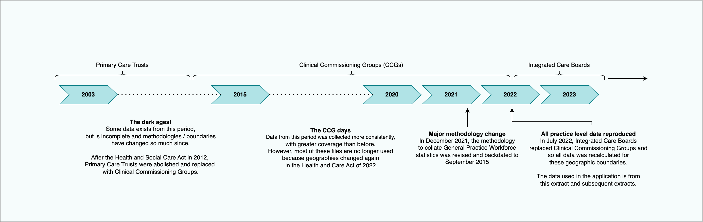

# gpcuts
Enable voters to see the impact of NHS funding cuts on their local community

## data setup

Setup virtual environment:
```bash
python -m venv venv
```

install required packages:
```bash
pip install -r ./data/py/requirements.txt
```

Start spyder:
```bash
spyder
```

## Sourcing GP Practice-level data

Data released by NHS digital on GPs has gone through many changes to methodologies over the past 20 years. The data in the application uses the latest available data, using the latest reccommended methodology.



To source the data for the application and run the `generate_dataset.py` [file](./data/py/generate_dataset.py), please download the practice-level csv files available [here](https://digital.nhs.uk/data-and-information/publications/statistical/general-and-personal-medical-services/31-july-2022). This link will take you to the General Practice Workforce series for July 2022. Subsequent releases of the data in the same format can be found [here](https://digital.nhs.uk/data-and-information/publications/statistical/general-and-personal-medical-services#latest-statistics).

Once downloaded, all these csv files should be dropped into the `/data/csv/raw` directory where they will be read in automatically the next time `generate_dataset.py` is run.

## Sourcing postcode data

The `generate_dataset.py` file will also need a `postcodes.csv` file saved under /data/csv/postcodes. This file contains every deliverable postcode in the UK and is used to obtain latitude & longitude coordinates for each GP practice listed in the data so that they can be plotted on the map.

See this link on [doogal](https://www.doogal.co.uk/PostcodeDownloads) to download the postcode data.

